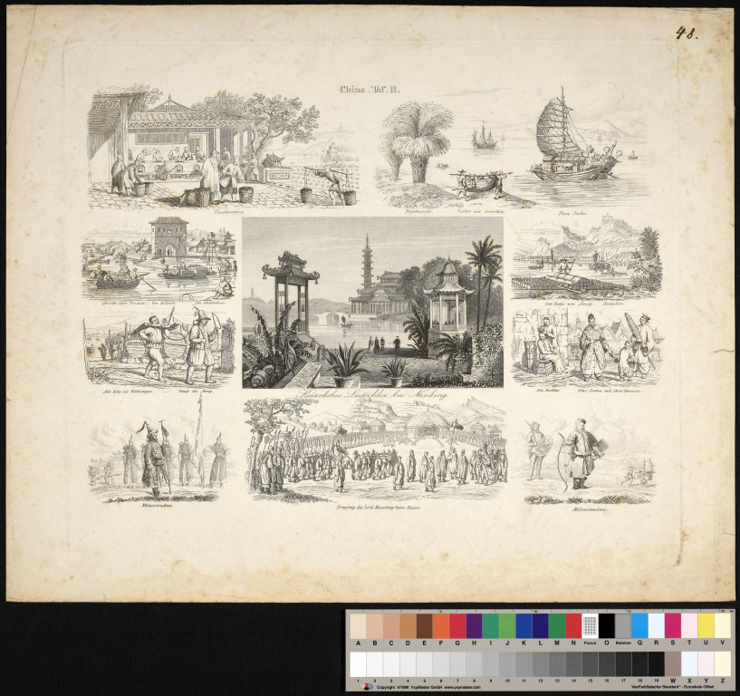

# CDV NI 2020

## Daten

* [Page 1](https://codingdavinci.de/de/daten?event%5B0%5D=1850)
* [Page 2](https://codingdavinci.de/de/daten?event%5B1850%5D=1850&institution=&search=&page=1)

# Ideas

## Collage

* given a set of images, slice them up and reorder them to create something new
* Text-Bild-Montage

## poster45gen

* use custom text, generate your message

With an adapter for current COVID-19 information, parsed from official sources.

## HSNS (historical social network site)

* identify people, locations and dates
* create a condensed dataset from various sources
* generate a (random) assemblage of posts in a timeline

## The machine likes to draw

